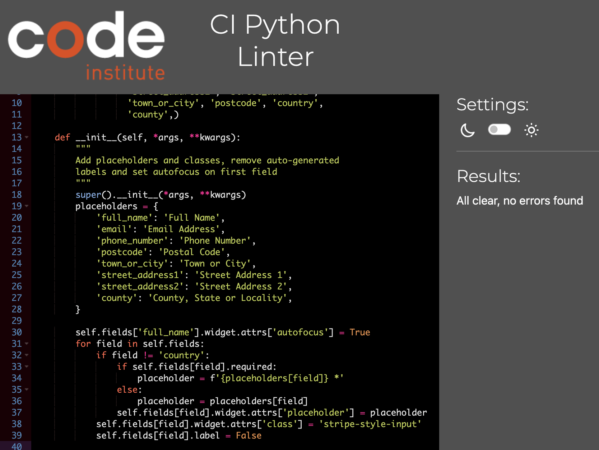
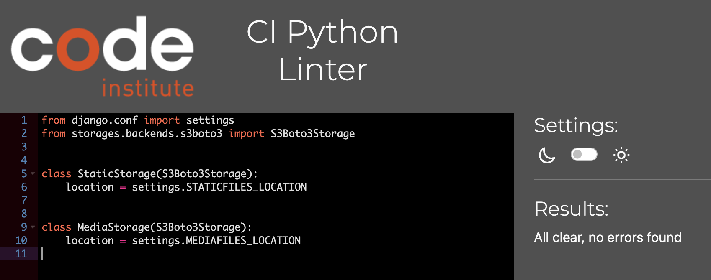

<h1>Igor Motors Project: Cars for Sale in Ireland</h1>

The "Igor Motors" project is an online platform designed to facilitate the process of buying and selling cars. The platform offers a convenient and user-friendly interface for individuals interested in purchasing vehicles. Additionally, it provides a unique feature that allows users to receive a cash offer for their own cars, simplifying the process of selling a vehicle.

Users can explore a wide range of available cars on the platform, with detailed descriptions, images, and specifications provided for each vehicle. This allows potential buyers to make informed decisions based on their preferences and requirements. For those looking to sell their cars, "Igor Motors" offers a streamlined process where users can input information about their vehicle and receive an instant cash offer.

By combining a comprehensive car buying experience with the added convenience of receiving cash offers for selling vehicles, "Igor Motors" aims to create a seamless and efficient marketplace for both buyers and sellers in the automotive industry.

## **[Live site](https://igormotors-fa74a181bdfa.herokuapp.com/)**

---

## **[Repository](https://github.com/Sergutin/IgorMotors)**

## Table of contents

* [Technologies Used](#technologies-used)
  * [HTML](#html)
  * [CSS](#css)
  * [Python](#python)
  * [Django](#django)
  * [Bootstrap 5](#bootstrap-5)
  * [Cloudinary](#cloudinary)
  * [Heroku PostgreSQL](#heroku-postgresql)
  * [Amazon AWS](#amazon-aws)
* [UX Design](#ux-design)
  * [Overview](#overview)
  * [Design](#design)
  * [Website User](#website-user)
  * [Main goals](#main-goals)
* [Agile methodology](#agile-methodology)
* [User Stories](#user-stories)
* [Features](#features)
* [Testing](#testing)
  * [HTML Test](#html-test)
  * [CSS Test](#css-test)
  * [CI Python Linter](#ci-python-linter)
  * [JShint Validator](#jshint-validator)
  * [Lighthouse](#lighthouse)
  * [Manual Testing](#manual-testing)
  * [Fixed Bugs](#fixed-bugs)
  * [Unfixed Bugs](#unfixed-bugs)
* [Deployment](#deployment)
  * [Cloning and forking](#cloning-and-forking)
* [Media](#media)

!!!!!! Web marketing strategy B2C

!!!!!! Facebook

## Technologies Used

  ### HTML
    I used HTML technology to structure and present the content of my Igor Motors Django project. HTML, which stands for HyperText Markup Language, is the fundamental building block of web pages. Through the use of HTML, I was able to create the visual layout and arrangement of various elements within the project.

    With HTML, I defined the structure of each web page, including headings, paragraphs, lists, and other components. By employing HTML tags and attributes, I organized the content into a logical hierarchy, ensuring proper formatting and readability for users.
    
  ### CSS
    CSS enhanced the visual appeal of my Igor Motors Django project. By defining styles for elements like colors, fonts, spacing, and responsive layouts, CSS ensured a consistent and attractive design across devices, elevating the user experience

  ### Python
    I utilized Python as the primary programming language for my Igor Motors Django project. Python's versatility and robustness were instrumental in building the backend functionality of the platform. I leveraged Django, a powerful Python web framework, to handle routing, database management, and user authentication.

    Python's clean and readable syntax facilitated efficient coding and debugging. With its extensive library support, I implemented various features such as handling user input, processing data, and integrating third-party services.
  ### Django
    Django, a high-level Python web framework, was the cornerstone of my Igor Motors project. With Django's built-in tools, I efficiently handled URL routing, database management, and user authentication. This framework streamlined the development process, allowing me to focus on creating a seamless and interactive platform for Igor Motors.
  ### Bootstrap 5
    Bootstrap 5, a popular front-end framework, played a vital role in shaping the visual layout and responsiveness of my Igor Motors project. By leveraging Bootstrap's pre-designed components and grid system, I established a consistent and modern design across the platform. This framework enabled efficient development and ensured a user-friendly experience, adapting seamlessly to various screen sizes and devices. 
  ### Cloudinary
    Cloudinary was integral to optimizing media management in my Igor Motors project. As a cloud-based media storage and delivery platform, Cloudinary facilitated efficient uploading, storage, and delivery of images for cars and other visual content. This enhanced the platform's performance by ensuring quick loading times and high-quality images, contributing to a seamless user experience.
  ### Heroku PostgreSQL
    For database management in my Igor Motors project, I turned to Heroku PostgreSQL. This fully managed and scalable relational database service offered by Heroku ensured the efficient storage, retrieval, and management of data. Heroku PostgreSQL's capabilities supported the seamless functioning of the platform, contributing to a reliable and robust user experience.
  ### Amazon AWS
    I harnessed the power of Amazon Web Services (AWS) for my Igor Motors project by utilizing Amazon S3 for efficient storage and Amazon IAM for secure access control. With Amazon S3, I seamlessly managed and stored media files, ensuring quick and reliable content delivery. Meanwhile, Amazon IAM provided granular control over user permissions, enhancing security and compliance throughout the platform.

## UX Design

  ### Overview
    Igor Motors is an innovative online platform that revolutionizes the car buying and selling experience. Seamlessly combining user-friendly interfaces with advanced technologies, the platform enables users to explore a wide range of vehicles for purchase while also offering the unique ability to receive instant cash offers for their own cars. 

  ### Design 
    The design of Igor Motors embodies a harmonious fusion of aesthetics and functionality. Employing Bootstrap 5, the platform boasts a sleek and modern interface that adapts seamlessly to various devices and screen sizes, ensuring a consistently engaging user experience. The integration of carefully selected colors, typography, and layout structures creates a visually appealing environment, enhancing readability and user interaction. Cloudinary optimizes media management, ensuring high-quality images, while Amazon AWS services like S3 and IAM contribute to a secure and efficient backend. In essence, Igor Motors' design encapsulates both form and function, catering to users seeking a sophisticated and intuitive car buying and selling platform.

  ### Website User
    The Igor Motors website would cater to a diverse range of users with varying automotive needs. Potential users include individuals interested in purchasing vehicles, seeking a wide selection of cars with detailed information and images. Additionally, individuals looking to sell their cars can benefit from the platform's cash offer feature, streamlining the process. Car enthusiasts, first-time buyers, and sellers alike would find value in the user-friendly interface and comprehensive features provided by Igor Motors.

  ### Main goals
    The main goals of the Igor Motors website are to provide a seamless and user-friendly platform for individuals interested in buying or selling cars.

## Agile methodology
  The Igor Motors project adopts the Agile methodology as its development approach. Agile is a collaborative and iterative framework that emphasizes flexibility, adaptability, and close communication between development teams and stakeholders. All the functionality and development of this project were handled through GitHub, where you can find the **[projects](https://github.com/Sergutin/IgorMotors/issues)**.

## User Stories

    To access the user stories, you can simply click on them below. User stories are a way to describe the desired functionality or features from the perspective of the end user. 

 1. [USER STORY: Registration](https://github.com/Sergutin/IgorMotors/issues/1)
 2. [USER STORY: Log in](https://github.com/Sergutin/IgorMotors/issues/2)
 3. [USER STORY: Log out](https://github.com/Sergutin/IgorMotors/issues/3)
 4. [USER STORY: Search](https://github.com/Sergutin/IgorMotors/issues/4)
 5. [USER STORY: Sort cars](https://github.com/Sergutin/IgorMotors/issues/5)
 6. [USER STORY: Browse specific makes](https://github.com/Sergutin/IgorMotors/issues/6)
 7. [USER STORY: Car description](https://github.com/Sergutin/IgorMotors/issues/7)
 8. [USER STORY: Add car to the garage](https://github.com/Sergutin/IgorMotors/issues/8)
 9. [USER STORY: Remove car from the garage](https://github.com/Sergutin/IgorMotors/issues/9)
 10. [USER STORY: Free delivery](https://github.com/Sergutin/IgorMotors/issues/10)
 11. [USER STORY: Grand total](https://github.com/Sergutin/IgorMotors/issues/11)
 12. [USER STORY: Admin car management](https://github.com/Sergutin/IgorMotors/issues/12)
 13. [USER STORY: Admin access to user orders](https://github.com/Sergutin/IgorMotors/issues/13)
 14. [USER STORY: Adding cars to favorites](https://github.com/Sergutin/IgorMotors/issues/14)
 15. [USER STORY: Removing cars from favorites](https://github.com/Sergutin/IgorMotors/issues/15)
 16. [USER STORY: User Profile Management](https://github.com/Sergutin/IgorMotors/issues/16)
 17. [USER STORY: Order History Viewing](https://github.com/Sergutin/IgorMotors/issues/17)
 18. [USER STORY: Popup Notifications for Garage/Bag](https://github.com/Sergutin/IgorMotors/issues/18)
 19. [USER STORY: Clear Feedback for Favorites Changes](https://github.com/Sergutin/IgorMotors/issues/19)
 20. [USER STORY: Contacting Admin via Message](https://github.com/Sergutin/IgorMotors/issues/20)
 21. [USER STORY: Cash for cars](https://github.com/Sergutin/IgorMotors/issues/21)

## Features

    The home page of the Igor Motors project consists of a dynamic and inviting layout that serves as the gateway to the platform's offerings. This page encompasses a variety of essential components designed to engage and inform users. It includes a visually appealing header with the Igor Motors title and navigation menu, allowing users to easily access different sections of the platform.:

    User features implemented are as follows:

- Users can register an account

- Users can log into their account

- Users can log out of their account

- Users can browse all cars

- Users can view car details

- Users can get a cash offer for their car if it is on the list of the cars required currently by Igor Motors

- Users can sort cars by year, make and price

- Users can add a car to the favorites and remove it from there

- Users can see their favorites and manage them from the "favorites" page of their account

- Users can send a message to the website administration through the "Contact Us" form

- Users can follow Igor Motors on Facebook and subscribe to the email newsletter

- Users can access their profile and see the history of all orders

- Users can add car to their bag (garage) and securely checkout using the form provided

  Furthermore, a notification is provided every time the user performs the following actions:

- User successfully logs in.

- User successfully logs out.

- User successfully adds a car to the bag/garage

- User successfully adds a car from the bag/garage

- User successfully created an order

- User successfully sent a message through "Contact Us" form

- User successfully removes the car from the favorites

- When a user successfully adds the car to favorites, the green button turns red and changes to 'Remove from Favorites'

- User successfully subscribed to the email newsletter

Additionally, an email confirmation is sent every time the user creates an account:

and creates an order:

 
Every time user send a message through Contact Us form, it goes into the admin's Gmail account with all details from the form:

When a new user subscribed to the email newsletter, admin can see these details through the Mailchimp "Audience"panel: 

If the page that users are looking for doesn't exist, they are provided with a custom 404 page stating 'THE PAGE YOU ARE LOOKING FOR ISN'T AVAILABLE'.

  Superuser / Admin

  As a Superuser or Admin, I have the ability to manage all CRUD functionality, including:

  1. Adding cars.
  2. Editing cars.
  3. Deleting cars.
  4. Managing Users information.
  5. Managing orders.

## Testing

    Account Registration Tests
| Test |Result  |
|--|--|
| User can create account | Pass |
| User can receive an email confirmation message | Pass |
| User can log into account | Pass |
| User can log out of account | Pass |

    Site Funstionality Tests
| Test |Result  |
|--|--|
| User can sort cars by model | Pass |
| User can sort cars by price | Pass |
| User can sort cars by year | Pass |
| User can browse specific car makes only | Pass |
| User can add car to favorites | Pass |
| User can remove car from favorites | Pass |
| User can see all their favorite cars on one page | Pass |
| User can add car to garage/bag | Pass |
| User can remove car from garage/bag | Pass |
| User can see their garage/bag details | Pass |
| User can securely checkout | Pass |
| User can get free delivery for orders exceeded 5000 EUR | Pass |
| User can see their profile details | Pass |
| User can see their orders details | Pass |
| User can receive a cash offer for their car if its on the list of required cars | Pass |
| User can send a message via Contact Us form | Pass |
| User can log out of account | Pass |
| User can log out of account | Pass |
| User can log out of account | Pass |
| User can log out of account | Pass |
| User can log out of account | Pass |
| User can log out of account | Pass |

    Admin Tests
| Test |Result  |
|--|--|
| Admin can add new car | Pass |
| Admin can delete a car | Pass |
| Admin can edit a car | Pass |
| Admin can add a user | Pass |
| Admin can change user details | Pass |
| Admin can delete a user | Pass |
| Admin can add new order | Pass |
| Admin can delete order | Pass |
| Admin can manage order details | Pass |

  ### HTML Test
    No errors were found when passing through the official HTML validator.

    

  ### CSS Test
    No errors were found when passing through the official (Jigsaw) CSS validator.

  ### CI Python Linter 
    No errors were found when passing through the CI Python Linter validator.

    Bag:

    Cars:

    Home:

    Profiles:

    IgorMotors:

    Checkout:

   

    Customstorages:

    Manage:

  ### JShint Validator 

  ### Lighthouse
    The website was measured using Lighthouse tool, performance 100% was calculated for desktop device:

    and 95-97% for mobile device:

  ### Manual testing
    Responsiveness was tested in different browsers:
<li>Chrome</li>

<li>Safari</li>

<li>Firefox</li>

    Tests were completed in following browsers from mobile device (iOS):
<li>Chrome</li>

<li>Safari</li>

    No broken links found, everything works as expected.

  ### Fixed Bugs
    During bug testing, it was discovered that the .gitignore file was not created, resulting in sensitive information being uploaded to GitHub. To address this issue, I recreated the database on PostgreSQL, updated all credentials in the env.py file and in the Heroku project settings, including the values for DATABASE_URL, SECRET_KEY, and CLOUDINARY_URL.

    Also the env.py was accidentally committed twice and the data was changed completely on both occasions.

    During HTML code testing, there were several errors:

  

    To fix them, I removed the trailing slash from the code line, removed 
 as a child of the <ul> element, and replaced it with paddings to make the footer part look user-friendly.

  ### Unfixed Bugs

There are no known unfixed bugs in the code

## Deployment

The site is deployed using GitHub Pages.

To deploy the site using GitHub Pages:

<ol>
<li>Login or signup to Github.</li>
<li>Go to the repository for this project, https://github.com/Sergutin/CookBook</li>
<li>At the top of the repository, locate the "Settings" button on the menu.</li>
<li>Select "Pages" section in the left hand menu.</li>
<li>From the "Source" dropdown select "Deploy from a Branch". Press "Save".</li>
<li>The site has now been deployed, please note that the process may take a few minutes before the site goes live.</li>
</ol>

  ### Cloning and forking

Forking a repository creates a copy of the original repository on GitHub account.
To fork a repository in GitHub:

<ol>
<li>On GitHub.com, navigate to the repository.</li>
<li>In the top-right corner of the page, click Fork.</li>
<li>Select an owner for the forked repository.</li>
<li>By default, forks are named the same as their parent repositories. You can change the name of the fork to distinguish it further.</li>
<li>Optionally, add a description of your fork.</li>
<li>Choose whether to copy only the default branch or all branches to the new fork. For many forking scenarios, such as contributing to open-source projects, you only need to copy the default branch. By default, only the default branch is copied.</li>
<li>Click Create fork.</li>
</ol>

Cloning a repository creates a copy of the original repository on our local machine.
To clone a repository in GitHub:

<ol>
<li>On GitHub.com, navigate to your fork of the repository.</li>
<li>Above the list of files, click  Code.</li>
<li>Copy the URL for the repository.</li>
<ul>
    <li>To clone the repository using HTTPS, click the "Copy" icon on the right of "HTTPS".</li>
<li>To clone the repository using an SSH key, including a certificate issued by your organization's SSH certificate authority, click SSH, then click the icon on the right to copy it.</li>
  <li>To clone a repository using GitHub CLI, click GitHub CLI, then click the "Copy" icon on the right.</li>
</ul>
</ol>

## Media
The main page image was taken from 
## **[Here](https://www.willflyforfood.net/wp-content/uploads/2021/09/irish-food-beef-stew-featured.jpg)**

Author recipe images were taken from:

## **[Dublin Coddle](https://assets.epicurious.com/photos/54b3f9dc21388ef838b10b56/1:1/w_2560%2Cc_limit/51224810_dublin-coddle_1x1.jpg)**
## **[Shepherd's Pie](https://modernmealmakeover.com/wp-content/uploads/2020/10/IMG_5119-4.jpg)**
## **[Barmbrack](https://www.irishtimes.com/resizer/r2D6UEcoKkF8fifu9hukowW3OsY=/1600x1600/filters:format(jpg):quality(70)/cloudfront-eu-central-1.images.arcpublishing.com/irishtimes/WOTKX2WAD44J4XJEGDBTSQ7WUU.jpg)**
## **[Irish stew](https://www.recipetineats.com/wp-content/uploads/2020/03/Irish-Beef-Guinness-Stew_6-SQ.jpg)**
## **[Seafood chowder](https://encrypted-tbn2.gstatic.com/images?q=tbn:ANd9GcRzuYaWTc_BrFkvZ53AJBWNBW-p9IhMJEt-UmmQHxVIIR9_goi9)**
## **[Irish Champ](https://www.chefnotrequired.com/wp-content/uploads/2018/06/champ-10-7.jpg)**
## **[Boxty](https://encrypted-tbn1.gstatic.com/images?q=tbn:ANd9GcT8PYJF1JjvzS5DHA8OmAqSWyabnxDVklIPfP_wsafNKmxtp9R0)**
## **[Bacon and cabbage](https://upload.wikimedia.org/wikipedia/commons/7/78/Bacon_and_Cabbage_in_Ireland.jpg)**
